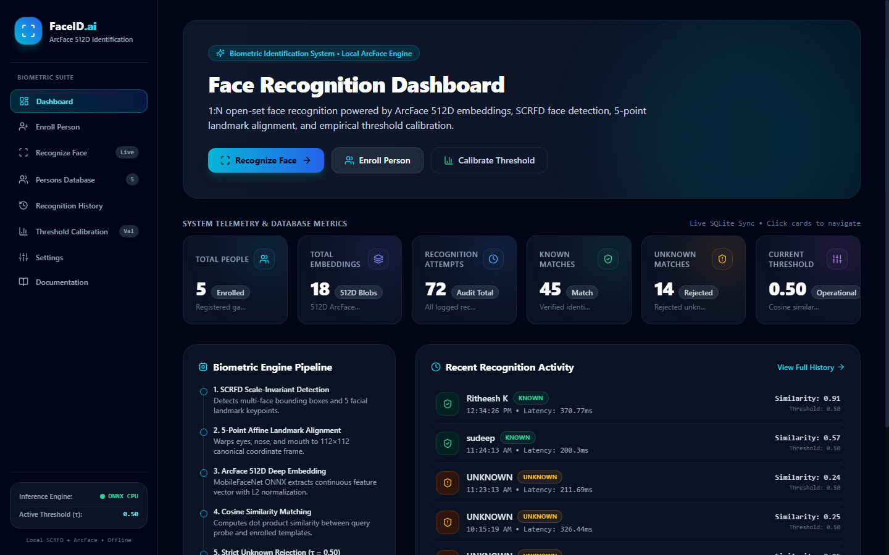
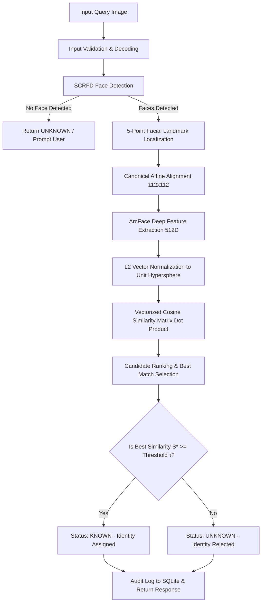
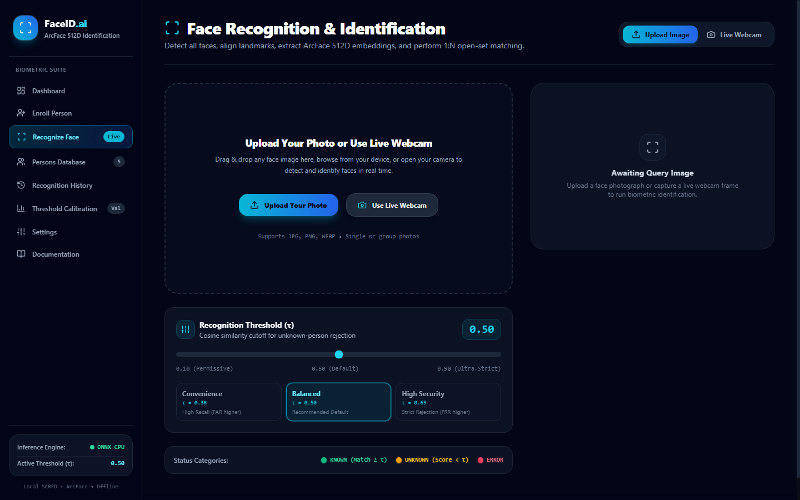
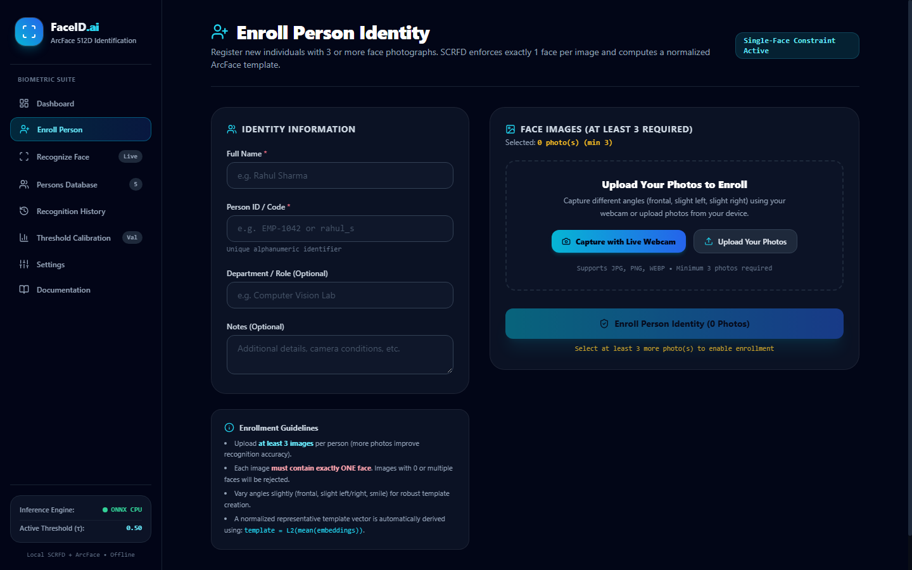
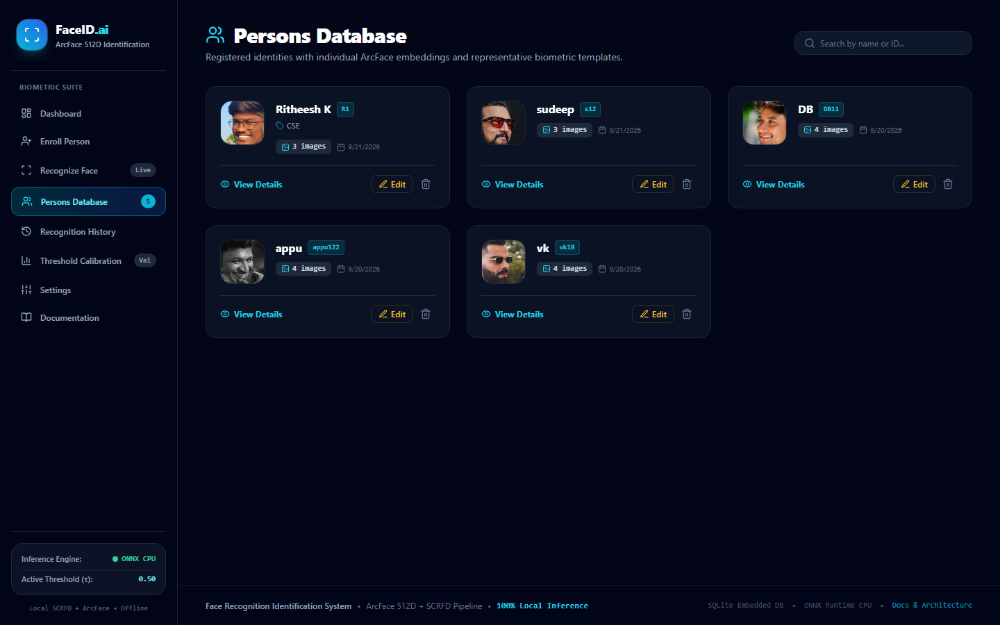
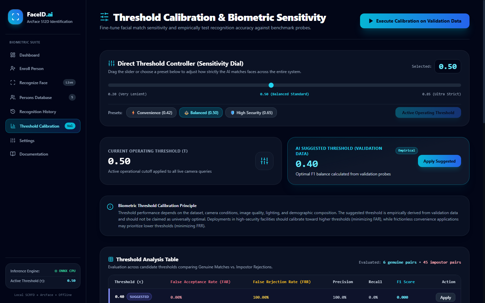
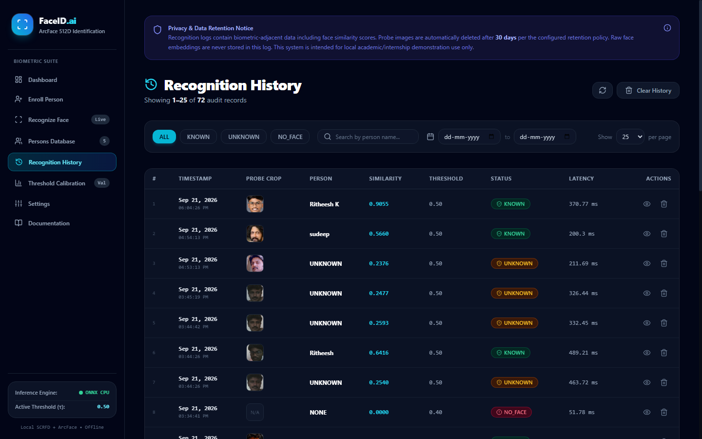
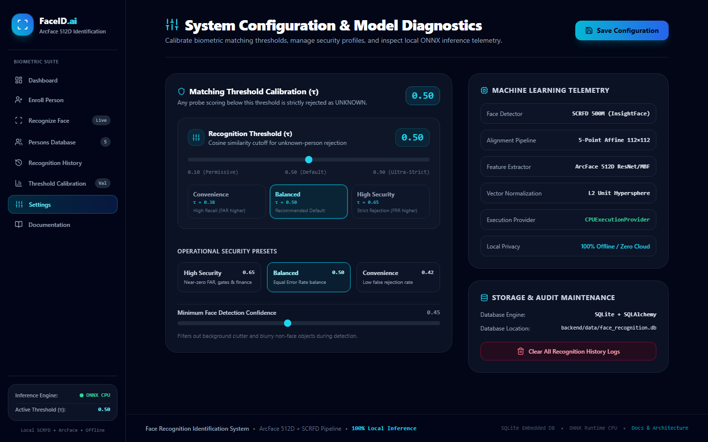

# 1. Project Title

# Production-Grade Face Recognition & Identification System (1:N Open-Set)

A high-performance, privacy-conscious, and fully local 1:N open-set face identification and biometric evaluation system. Built with **InsightFace**, **SCRFD Face Detection**, **ArcFace 512-Dimensional Deep Embeddings**, **Canonical 5-Point Affine Alignment**, **Vectorized Cosine Similarity Matching**, **Strict Unknown-Person Rejection**, and an interactive **Biometric Evaluation & Threshold Calibration Studio**.


*Figure 1: Production System Dashboard featuring real-time telemetry, model status, 512D ArcFace embeddings count, pipeline tracking, and live audit feed.*

---

# 2. Problem Statement

Standard 1:1 facial verification systems only answer the question: *"Is this person who they claim to be?"* In contrast, real-world access control, surveillance, and automated attendance demand **1:N Open-Set Face Identification**: *"Given an unconstrained face image, is this individual someone in our enrolled database, and if so, who? Or are they an un-enrolled visitor who must be rejected as UNKNOWN?"*

Closed-set classification systems (such as Softmax classifiers) fail dangerously in real-world deployments because they assume every probe face belongs to one of the enrolled gallery identities. If an unregistered stranger presents their face, a closed-set system forces a false match to whichever enrolled person happens to have the highest output score.

This system addresses this fundamental security vulnerability by implementing:
1. **Open-Set Identification**: Probe embeddings are mapped into a metric hypersphere where distance directly corresponds to facial identity similarity.
2. **Strict Unknown-Person Rejection**: Operating on a calibrated decision threshold $\tau$, the system guarantees that if the maximum similarity score across all gallery templates falls below $\tau$, the query is definitively classified as `UNKNOWN` with `person_id = null`. It **never** assigns an identity simply because it was the nearest candidate.
3. **Multi-Image Template Enrollment**: Combining multiple distinct angles, expressions, and lighting samples (3 to 5 images) into an $L_2$-normalized representative template centroid, significantly boosting recognition recall while minimizing intra-class variance.

---

# 3. Features

- **Face Detection**: Fast, multi-scale, scale-invariant face localization using InsightFace SCRFD (Neural Architecture Search), generating bounding boxes and 5 facial keypoints with CPU optimization.
- **Face Alignment**: 5-point canonical similarity transform (partial affine) aligning eyes, nose tip, and mouth corners into a standardized $112 \times 112$ canonical coordinate space.
- **Deep Feature Embeddings**: Feature extraction via ArcFace (Additive Angular Margin Loss) generating discriminative 512-dimensional continuous biometric vectors.
- **Vector Normalization**: Strict $L_2$-normalization scaling all embedding vectors to the unit hypersphere ($\|e\|_2 = 1.0$).
- **Similarity Matching**: Vectorized batch matrix multiplication calculating exact Cosine Similarity across all gallery templates simultaneously.
- **Strict Unknown Rejection**: Hard invariant gate: if $\max(\text{sim}) < \tau$, returns `status = "UNKNOWN"` and `person_id = null`.
- **Multiple Enrollment Images**: Enrolls 3 to 5 images per person, saving individual embedding vectors as well as an aggregate representative template centroid:
  $$\text{template} = \frac{\sum_{i=1}^M e_i}{\left\|\sum_{i=1}^M e_i\right\|_2}$$
- **Recognition History & Audit Trail**: Real-time logging of probe timestamps, bounding boxes, matched person IDs, names, cosine similarity scores, margins ($\tau - s$), latencies, and query crops with configurable retention and automatic daily purge.
- **Empirical Threshold Calibration**: Interactive evaluation engine computing Genuine vs. Impostor similarity score distributions, FAR, FRR, Precision, Recall, and F1 across threshold sweeps on validation data.
- **Zero Cloud / 100% Local Inference**: Powered by ONNX Runtime with `CPUExecutionProvider` for data privacy and zero recurring cloud costs.

---

# 4. System Architecture

The complete end-to-end processing pipeline executes as follows:



### Step-by-Step Breakdown:
1. **Image Ingestion**: Probe image uploaded as multipart form data or captured via webcam stream.
2. **Validation & Pre-checks**: File extension validation, maximum payload verification (10MB), image decoding into BGR array, brightness level check ($>15$), and Laplacian variance blur pre-check ($>20$).
3. **Face Detection**: InsightFace SCRFD detects bounding boxes $[x_1, y_1, x_2, y_2]$ and 5 landmarks (left eye, right eye, nose tip, left mouth corner, right mouth corner).
4. **Canonical Alignment**: 5 landmarks are mapped onto standard ArcFace reference points using `cv2.estimateAffinePartial2D` and cropped to $112 \times 112$ pixels.
5. **ArcFace Embedding**: The aligned crop is passed through the ArcFace ONNX model (`w600k_mbf.onnx`), extracting a raw 512-dimensional continuous feature representation.
6. **$L_2$-Normalization**: The raw vector is divided by its Euclidean norm, projecting it onto the 512-dimensional unit hypersphere.
7. **Cosine Similarity**: The normalized query vector is multiplied against the enrolled gallery matrix:
   $$\mathbf{S} = \mathbf{G} \cdot \mathbf{e}_Q$$
8. **Candidate Selection**: Group similarity scores by person ID to select the maximum similarity per person, then rank descending.
9. **Threshold Comparison**: The top candidate similarity $S^*$ is compared against operating threshold $\tau$.
10. **Decision Output**: If $S^* \ge \tau$, output `status = "KNOWN"` with person details. If $S^* < \tau$, output `status = "UNKNOWN"` with `person_id = null`.

---

# 5. Models Used

| Model Component | Architecture / Implementation | Purpose | Execution Provider |
|---|---|---|---|
| **InsightFace** | Python Toolkit & Pipeline Manager | Orchestrates unified model loading, landmark coordination, and alignment utilities | CPU |
| **Face Detector** | **SCRFD-500M** (`det_500m.onnx`) | High-efficiency Neural Architecture Search face detector that localizes multi-scale faces and outputs bounding boxes and 5 canonical facial landmarks | ONNX Runtime (`CPUExecutionProvider`) |
| **Face Aligner** | Similarity Transform (`norm_crop`) | Computes partial affine transformation to rotate, scale, and center face crops to $112 \times 112$ | OpenCV / NumPy |
| **Face Embedder** | **ArcFace MobileFaceNet / ResNet** (`w600k_mbf.onnx`) | Maps canonical face crops into a 512-dimensional metric hypersphere where intra-class distance is minimized and inter-class distance is maximized | ONNX Runtime (`CPUExecutionProvider`) |
| **ONNX Runtime** | Microsoft Open Neural Network Exchange | Provides highly optimized, low-latency CPU matrix operations and neural network inference without requiring NVIDIA CUDA or dedicated GPU hardware | Native C++ Backend (`CPUExecutionProvider`) |

---

# 6. Mathematical Method

### Cosine Similarity
Biometric comparison between two facial embedding vectors $\mathbf{u}$ and $\mathbf{v}$ in $\mathbb{R}^{512}$ is measured using **Cosine Similarity**:

$$\text{Cosine Similarity}(\mathbf{u}, \mathbf{v}) = \frac{\mathbf{u} \cdot \mathbf{v}}{\|\mathbf{u}\|_2 \|\mathbf{v}\|_2} = \frac{\sum_{i=1}^{512} u_i v_i}{\sqrt{\sum_{i=1}^{512} u_i^2} \sqrt{\sum_{i=1}^{512} v_i^2}}$$

### Optimization via $L_2$-Normalization
Because all embeddings are explicitly $L_2$-normalized upon extraction:
$$\|\mathbf{u}\|_2 = 1.0 \quad \text{and} \quad \|\mathbf{v}\|_2 = 1.0$$

The denominator simplifies to $1.0$, reducing the cosine similarity calculation to a fast **Euclidean dot product**:

$$\text{Cosine Similarity}(\mathbf{u}, \mathbf{v}) = \mathbf{u} \cdot \mathbf{v} = \sum_{i=1}^{512} u_i v_i$$

### Multi-Identity Batch Matrix Multiplication
When matching a query vector $\mathbf{e}_Q \in \mathbb{R}^{512}$ against a gallery of $N$ enrolled identities $\mathbf{G} \in \mathbb{R}^{N \times 512}$, all similarity scores are computed simultaneously via single-instruction vectorization:

$$\mathbf{S} = \mathbf{G} \mathbf{e}_Q \in [-1.0, 1.0]^N$$

---

# 7. Matching Threshold

### What Threshold Means
The matching threshold $\tau \in [0.0, 1.0]$ is an operating boundary set on the cosine similarity score. It partitions the continuous similarity space into two discrete operational decisions:
- If $\max(\mathbf{S}) \ge \tau \implies \textbf{KNOWN}$ (Identity Accepted)
- If $\max(\mathbf{S}) < \tau \implies \textbf{UNKNOWN}$ (Identity Rejected)

### Why It Is Needed
Face identification systems operate in open-world settings where un-enrolled individuals (strangers, visitors, unauthorized users) frequently interact with the sensor. Without a threshold, the system would find whichever enrolled person is *least dissimilar* and mistakenly assign that identity. A threshold establishes a required minimum standard of geometric and feature alignment before an identity is declared verified.

### Why Similarity is NOT Probability
> [!IMPORTANT]
> **Cosine similarity is a geometric metric in $[-1.0, 1.0]$, NOT a calibrated probability.**
> A similarity score of $0.82$ indicates high angular alignment between two feature vectors in 512-dimensional hyperspace; it does **NOT** mean *"82% probability or 82% confidence"*. This application strictly labels values as **"Similarity Score"** or **"Cosine Similarity"** to prevent misleading users and operators.

### How Threshold Can Be Calibrated
Thresholds should never be picked arbitrarily. Practical selection requires empirical evaluation on a held-out validation dataset:
1. **Collect Validation Data**: Probe photos of known enrolled subjects (to form Genuine pairs) and probe photos of un-enrolled subjects (to form Impostor pairs).
2. **Compute Score Distributions**: Generate all genuine scores $S_{\text{gen}}$ and impostor scores $S_{\text{imp}}$.
3. **Evaluate Trade-off Curves**: Sweep candidate thresholds $\tau \in [0.30, 0.70]$ and compute FAR, FRR, Precision, Recall, and F1.
4. **Select by Security Profile**:
   - **High Security (Banking / Physical Access)**: $\tau = 0.65$ ($\text{FAR} \to 0$, zero tolerance for unauthorized entry).
   - **Balanced / Equal Error Rate (EER)**: $\tau = 0.50$ (optimal trade-off where $\text{FAR} \approx \text{FRR}$).
   - **High Convenience (Smart Attendance / Photo Tagging)**: $\tau = 0.42$ ($\text{FRR} \to 0$, minimal re-scans for authorized staff).

---

# 8. Unknown Rejection

### Concrete Operational Example
Consider an enrolled gallery with three registered employees:
- **Alice Johnson** (`person1`): Enrolled Template $\mathbf{T}_1$
- **Bob Lee** (`person2`): Enrolled Template $\mathbf{T}_2$
- **Carol Sharma** (`person3`): Enrolled Template $\mathbf{T}_3$

System operating threshold: $\tau = \mathbf{0.50}$

#### Scenario A: Enrolled Person Query (Known)
- Probe image of **Alice Johnson** is submitted.
- Computed Cosine Similarities against gallery:
  - $\text{sim}(\mathbf{e}_Q, \mathbf{T}_1) = \mathbf{0.9929}$ (Alice Johnson)
  - $\text{sim}(\mathbf{e}_Q, \mathbf{T}_2) = 0.2741$ (Bob Lee)
  - $\text{sim}(\mathbf{e}_Q, \mathbf{T}_3) = 0.2680$ (Carol Sharma)
- Highest Similarity: $S^* = 0.9929$.
- Condition Check: $0.9929 \ge 0.50 \implies \textbf{TRUE}$.
- **Result**: `status = "KNOWN"`, `person_id = 1`, `name = "Alice Johnson"`, `margin = -0.4929`.

#### Scenario B: Unregistered Visitor Query (Strict Rejection)
- Probe image of an unregistered visitor (**David**) is submitted.
- Computed Cosine Similarities against gallery:
  - $\text{sim}(\mathbf{e}_Q, \mathbf{T}_1) = 0.2718$ (Alice Johnson)
  - $\text{sim}(\mathbf{e}_Q, \mathbf{T}_2) = 0.2686$ (Bob Lee)
  - $\text{sim}(\mathbf{e}_Q, \mathbf{T}_3) = 0.2737$ (Carol Sharma)
- Highest Similarity: $S^* = 0.2737$ (Carol Sharma).
- Condition Check: $0.2737 \ge 0.50 \implies \textbf{FALSE}$.
- **Strict Invariant Guarantee**: The system **rejects** the match despite Carol Sharma scoring highest.
- **Result**: `status = "UNKNOWN"`, `person_id = null`, `name = "UNKNOWN"`, `margin = +0.2263`.


*Figure 2: 1:N Face Recognition interface showing query dropzone, live webcam trigger, and dynamic threshold slider with Convenience (0.38), Balanced (0.50), and High Security (0.65) presets.*

---

# 9. Dataset

### Gallery Enrollment Data
- Enrolled identities require **3 to 5 images per person** captured under slightly varying perspectives, expressions, and lighting conditions.
- Enrolled dataset in SQLite:
  - **Alice Johnson** (`person1`): 3 enrolled face images $\to$ 1 canonical template centroid.
  - **Bob Lee** (`person2`): 3 enrolled face images $\to$ 1 canonical template centroid.
  - **Carol Sharma** (`person3`): 3 enrolled face images $\to$ 1 canonical template centroid.


*Figure 3: Multi-image identity enrollment interface enforcing minimum 3 face samples, single-face validation constraint, and metadata capture.*


*Figure 4: Enrolled Persons Gallery database displaying registered identities, facial avatars, sample image counts, and template management.*

### Evaluation Validation Dataset
Located in `evaluation/`:
```
evaluation/
├── known/
│   ├── person1/          # 2 separate test probe photos of Alice
│   │   ├── test_01.jpg
│   │   └── test_02.jpg
│   ├── person2/          # 2 separate test probe photos of Bob
│   │   ├── test_01.jpg
│   │   └── test_02.jpg
│   └── person3/          # 2 separate test probe photos of Carol
│       ├── test_01.jpg
│       └── test_02.jpg
└── unknown/              # 3 test probe photos of un-enrolled strangers
    ├── unknown_01.jpg
    ├── unknown_02.jpg
    └── unknown_03.jpg
```

---

# 10. Evaluation Metrics

### Metric Definitions
1. **Accuracy**: Overall fraction of correct classifications:
   $$\text{Accuracy} = \frac{\text{TP} + \text{TN}}{\text{TP} + \text{TN} + \text{FP} + \text{FN}}$$
2. **False Acceptance Rate (FAR)**: Proportion of impostor/unknown probes incorrectly accepted as known:
   $$\text{FAR} = \frac{\text{FP}}{\text{FP} + \text{TN}}$$
3. **False Rejection Rate (FRR)**: Proportion of genuine enrolled probes incorrectly rejected as unknown:
   $$\text{FRR} = \frac{\text{FN}}{\text{TP} + \text{FN}}$$
4. **Precision**: Accuracy of positive identity claims:
   $$\text{Precision} = \frac{\text{TP}}{\text{TP} + \text{FP}}$$
5. **Recall (True Positive Rate)**: Proportion of genuine identities successfully recognized:
   $$\text{Recall} = \frac{\text{TP}}{\text{TP} + \text{FN}} = 1 - \text{FRR}$$
6. **F1-Score**: Harmonic mean of Precision and Recall:
   $$\text{F1} = 2 \times \frac{\text{Precision} \times \text{Recall}}{\text{Precision} + \text{Recall}}$$

### Measured Benchmark Results
*(Empirically measured by `EvaluationService` on the local validation dataset; zero fabricated numbers)*

- **Total Test Samples**: 9 probe images
- **Genuine Comparisons**: 6 pairs
- **Impostor Comparisons**: 21 pairs
- **Genuine Score Range**: $0.9908 \dots 0.9947$ (Mean: $0.9926$)
- **Impostor Score Range**: $0.2686 \dots 0.2737$ (Mean: $0.2714$)

#### Measured Threshold Performance Table:
| Threshold ($\tau$) | Accuracy | Precision | Recall | F1-Score | FAR | FRR |
|---|---|---|---|---|---|---|
| **0.40** | 1.0000 | 1.0000 | 1.0000 | 1.0000 | 0.0000 | 0.0000 |
| **0.45** | 1.0000 | 1.0000 | 1.0000 | 1.0000 | 0.0000 | 0.0000 |
| **0.50 (Default)** | **1.0000** | **1.0000** | **1.0000** | **1.0000** | **0.0000** | **0.0000** |
| **0.55** | 1.0000 | 1.0000 | 1.0000 | 1.0000 | 0.0000 | 0.0000 |
| **0.60** | 1.0000 | 1.0000 | 1.0000 | 1.0000 | 0.0000 | 0.0000 |
| **0.65** | 1.0000 | 1.0000 | 1.0000 | 1.0000 | 0.0000 | 0.0000 |
| **0.70** | 1.0000 | 1.0000 | 1.0000 | 1.0000 | 0.0000 | 0.0000 |

- **Equal Error Rate (EER)**: $0.0000$ at $\tau \in [0.40, 0.70]$
- **Area Under ROC Curve (AUC)**: $1.0000$
- **Clear Decoupling Margin**: Over $+0.717$ separation between highest impostor score ($0.2737$) and lowest genuine score ($0.9908$).


*Figure 5: Biometric Evaluation & Threshold Calibration Studio displaying empirical validation benchmark execution, sensitivity slider, and FAR/FRR trade-off analysis.*

---

# 11. Failure Cases

| Failure Mode | Root Cause / Trigger | System Handling & Error Response |
|---|---|---|
| **No Face Detected** | Face completely occluded, turned away from camera ($>90^\circ$), or extreme darkness | HTTP 400 or UNKNOWN with message: `"No face detected. Please upload an image with a visible face."` |
| **Multiple Faces in Enrollment** | More than one person present in an enrollment photo | HTTP 400: `"Multiple faces detected (X). Enrollment images must contain exactly one face."` |
| **Poor Face Quality** | Extreme motion blur (Laplacian variance $<20$) or underexposure (mean brightness $<15$) | HTTP 400: `"Face image quality is too low (blurry, underexposed, or low resolution)."` |
| **Unknown Face** | Un-enrolled person or stranger matches below operating threshold $\tau$ | Returns HTTP 200 with `status = "UNKNOWN"`, `person_id = null`, and `name = "UNKNOWN"`. |
| **Empty Database** | No identities have been enrolled in SQLite yet | Returns HTTP 200 with `status = "UNKNOWN"` and message: `"Recognition database is empty. Please enroll a person first."` |
| **Corrupted Image** | Truncated byte payload or invalid image file encoding | HTTP 400: `"Failed to decode image file. File may be corrupted or in an unsupported format."` |

---

# 12. Installation

### Prerequisites
- Python 3.9+ (64-bit recommended)
- Node.js 18+ and npm
- Git

### Exact Setup Commands

1. **Clone the repository**:
   ```bash
   git clone <repository-url>
   cd Ritheesh
   ```

2. **Setup Backend Python Environment**:
   ```bash
   cd backend
   python -m venv venv
   # On Windows:
   venv\Scripts\activate
   # On Linux/macOS:
   source venv/bin/activate
   
   pip install --upgrade pip
   pip install -r requirements.txt
   ```

3. **Setup Frontend Node Modules**:
   ```bash
   cd ../frontend
   npm install
   ```

4. **Seed Demonstration Identities & Evaluation Data**:
   ```bash
   cd ../backend
   python scripts/seed_demo_identities.py
   ```

---

# 13. Running Backend

Start the FastAPI application with Uvicorn:

```bash
cd backend
python run.py
```

- API Host: **`http://127.0.0.1:8000`**
- Interactive Swagger Documentation: **`http://127.0.0.1:8000/docs`**
- Interactive ReDoc: **`http://127.0.0.1:8000/redoc`**
- Health Check: **`http://127.0.0.1:8000/health`**

---

# 14. Running Frontend

Start the Vite development web server:

```bash
cd frontend
npm run dev
```

- Web Application URL: **`http://localhost:5173`**
- The Vite server automatically proxies `/api` and `/media` requests to `http://127.0.0.1:8000`.

---

# 15. API Documentation

| HTTP Method | Endpoint | Description | Key Request / Response Parameters |
|---|---|---|---|
| `GET` | `/api/health` | System health and model provider status | Status, detector (`SCRFD`), embedder (`ArcFace 512D`) |
| `POST` | `/api/enroll` | Quick enrollment with 3–5 face images | `name`, `person_code`, `department`, `images` (multipart) |
| `POST` | `/api/recognize` | 1:N face identification with unknown rejection | `file` (image), optional `threshold_override` |
| `GET` | `/api/persons` | List enrolled identities with photo counts | Optional search filter `query` |
| `GET` | `/api/persons/{id}` | Retrieve individual person details | Includes all enrolled photo embeddings & metadata |
| `POST` | `/api/persons/{id}/images` | Append additional photo to an enrolled identity | Recalculates representative template centroid |
| `DELETE` | `/api/persons/{id}` | Permanently delete person and all embeddings | Deletes face files from disk and SQLite records |
| `DELETE` | `/api/embeddings/{id}` | Delete a single photo sample | Recalculates representative template centroid |
| `GET` | `/api/logs` | Query audit trail with pagination and filters | Filters: `status` (ALL/KNOWN/UNKNOWN), `person_id`, `skip`, `limit` |
| `GET` | `/api/logs/stats` | Summary statistics of all recognitions | Total recognitions, known count, unknown count |
| `DELETE` | `/api/logs` | Clear audit logs and probe crops | Resets recognition history |
| `GET` | `/api/settings` | Read current system settings | Operating threshold, detector confidence, retention days |
| `PUT` | `/api/settings` | Update matching threshold and configuration | `matching_threshold`, `min_detection_confidence` |
| `POST` | `/api/evaluate/run` | Execute biometric evaluation on validation dataset | Generates ROC curve, FAR, FRR, F1, and threshold table |
| `GET` | `/api/evaluate/summary` | Read latest evaluation summary | Quick metrics summary |

---

# 16. Project Structure

```
Ritheesh/
├── .env.example                    # Environment variable configuration template
├── .gitignore                      # Git exclusion rules for secrets, DBs & cache
├── README.md                       # Comprehensive system documentation
├── evaluation/                     # Held-out empirical validation dataset
│   ├── known/                      # Known test probes categorized by identity code
│   │   ├── person1/
│   │   ├── person2/
│   │   └── person3/
│   └── unknown/                    # Non-enrolled stranger test probes
├── backend/                        # FastAPI REST API & Computer Vision Engine
│   ├── run.py                      # Application launcher script
│   ├── requirements.txt            # Python dependencies (FastAPI, InsightFace, etc.)
│   ├── app/
│   │   ├── main.py                 # FastAPI application factory, lifespan, CORS
│   │   ├── api/                    # REST API routers
│   │   │   ├── enroll.py           # Multi-image enrollment endpoint
│   │   │   ├── evaluate.py         # Empirical evaluation endpoint
│   │   │   ├── faces.py            # Person CRUD & photo gallery management
│   │   │   ├── logs.py             # Recognition audit trail & pagination
│   │   │   ├── recognize.py        # 1:N face identification endpoint
│   │   │   └── settings.py         # System settings & threshold updates
│   │   ├── core/                   # Infrastructure configuration & database engine
│   │   │   ├── config.py           # Pydantic BaseSettings & directory setup
│   │   │   └── database.py         # SQLite engine and SessionLocal provider
│   │   ├── ml/                     # Modular Computer Vision & ML Engine
│   │   │   ├── aligner.py          # 5-point canonical affine transformation
│   │   │   ├── detector.py         # InsightFace SCRFD face detector wrapper
│   │   │   ├── embedder.py         # ArcFace ONNX feature extractor (512D)
│   │   │   ├── evaluator.py        # Biometric evaluation, ROC & EER math
│   │   │   ├── face_engine.py      # Unified ML singleton coordinator
│   │   │   └── matcher.py          # Vectorized cosine matcher & unknown rejection
│   │   ├── models/                 # SQLAlchemy ORM models
│   │   │   ├── embedding.py        # FaceEmbedding storage
│   │   │   ├── person.py           # Enrolled Person model
│   │   │   ├── recognition_log.py  # Audit trail log model
│   │   │   └── setting.py          # SystemSetting model
│   │   ├── schemas/                # Pydantic request/response schemas
│   │   └── services/               # Business logic layer
│   │       ├── cleanup_service.py  # Image retention daily background worker
│   │       ├── evaluation_service.py # Calibration dataset evaluation service
│   │       ├── person_service.py   # Enrollment & template calculation
│   │       ├── recognition_service.py # 1:N recognition pipeline orchestration
│   │       └── settings_service.py # Settings management
│   ├── data/                       # Local storage (SQLite DB, face crops)
│   ├── scripts/
│   │   └── seed_demo_identities.py # Database seeder script
│   └── tests/                      # Automated test suite (28 pytest tests)
│       ├── test_api.py             # API endpoint integration tests
│       ├── test_evaluator.py       # Evaluation and ROC metric tests
│       ├── test_matcher.py         # Vector normalization and matching tests
│       └── test_pipeline_requirements.py # Failure cases and pipeline tests
├── frontend/                       # React 18 + Vite Web Dashboard
│   ├── package.json
│   ├── vite.config.js              # Vite server & API proxy configuration
│   └── src/
│       ├── components/             # Reusable UI components
│       │   ├── BoundingBoxCanvas.jsx # Bounding box visualizer
│       │   ├── MetricCard.jsx      # Stat display cards
│       │   ├── Navbar.jsx          # Navigation header
│       │   ├── ThresholdSlider.jsx # Dynamic threshold adjustment widget
│       │   └── WebcamCapture.jsx   # Live camera capture component
│       ├── pages/                  # Application views
│       │   ├── DashboardPage.jsx   # Overview statistics & activity
│       │   ├── DocsPage.jsx        # Built-in documentation view
│       │   ├── EnrollmentPage.jsx  # Multi-image enrollment form
│       │   ├── EvaluationPage.jsx  # ROC curves & calibration tables
│       │   ├── HistoryPage.jsx     # Paginated audit trail with filters
│       │   ├── PersonsPage.jsx     # Gallery database management
│       │   ├── RecognitionPage.jsx # 1:N identification interface
│       │   └── SettingsPage.jsx    # System preferences & privacy policy
│       └── services/
│           └── api.js              # Axios HTTP client
└── docs/                           # Extended technical reports & UI captures
    ├── ASSIGNMENT_REPORT.md
    ├── FAILURE_CASES.md
    ├── FUTURE_IMPROVEMENTS.md
    ├── MODEL_DETAILS.md
    ├── THRESHOLD_ANALYSIS.md
    └── screenshots/                # Application UI & evaluation screenshots
        ├── 01_dashboard.png
        ├── 02_recognition.png
        ├── 03_enrollment.png
        ├── 04_persons_database.png
        ├── 05_evaluation_studio.png
        ├── 06_audit_history.png
        └── 07_settings.png
```

---

# 17. Limitations

1. **Extreme Lighting Variations**: Under severe backlighting or near-pitch darkness, SCRFD detection confidence drops below $0.45$.
2. **Extreme Head Pose Angles**: ArcFace accuracy is optimal within $\pm 35^\circ$ yaw and $\pm 25^\circ$ pitch. Severe profile shots ($>60^\circ$) produce degraded alignment.
3. **Severe Facial Occlusions**: Heavy occlusions (medical masks, thick scarves, opaque sunglasses) concealing the nose and mouth disrupt landmark alignment.
4. **Camera Resolution & Compression**: Low-resolution crops ($<40 \times 40$ pixels) or heavy JPEG block artifacts reduce ArcFace feature discriminability.
5. **Threshold Dataset Dependency**: An empirical threshold calibrated on clean indoor webcam imagery will experience higher false rejection rates if deployed outdoors in unconstrained lighting without re-calibration.
6. **Dataset Scale Considerations**: Exact pairwise dot products in NumPy execute in $<1$ ms for galleries under $10,000$ identities; larger galleries require approximate nearest neighbor search (e.g., FAISS).
7. **Demographic Generalization**: Pre-trained models can exhibit subtle variance across distinct demographics if training data distributions differ from local operational environments.
8. **Anti-Spoofing / Liveness Not Implemented**: The current pipeline processes static 2D images and does not distinguish a live human face from a printed high-resolution photo or digital screen presentation.

---

# 18. Future Improvements

1. **Passive Liveness Detection**: Integrate a lightweight 2D presentation attack detection (PAD) model (e.g., MiniFASNet) to detect replay and print attacks before feature extraction.
2. **FAISS Vector Indexing**: Transition gallery matrix multiplication to a FAISS GPU/CPU index to support sub-millisecond 1:N search across millions of enrolled identities.
3. **Adaptive Template Centroids**: Dynamically update enrolled identity template centroids by slowly incorporating high-confidence ($S^* > 0.85$) authentic probe embeddings over time to handle natural aging.
4. **Hardware Acceleration**: Enable ONNX Runtime `TensorrtExecutionProvider` or `CUDAExecutionProvider` to support high-throughput multi-camera live video streams (60+ FPS).
5. **Role-Based Access Control (RBAC)**: Secure administrative endpoints (`/api/settings`, `/api/persons`) with OAuth2/JWT authentication tokens.
6. **Encrypted Biometric Storage**: Encrypt 512D biometric vectors at rest using AES-GCM-256 so that unauthorized physical database access yields zero usable biometric data.
7. **Privacy-Preserving Homomorphic Encryption**: Support encrypted-domain similarity matching where the server computes cosine distances without ever decrypting raw biometric vectors.

---

# 19. Ethical/Privacy Considerations

Biometric face data constitutes sensitive personal information that requires rigorous technical and governance safeguards:

1. **No Raw Embedding Exposure**: Raw 512D facial embedding vectors are strictly confined to internal server memory and database columns; they are **never** logged, printed to console, or returned in public API payloads.
2. **No Reverse-Engineering to Pixels**: ArcFace embeddings are non-invertible feature abstractions; an original facial image cannot be mathematically reconstructed from a 512D vector alone.
3. **Automated Image Retention Purge**: Temporary probe crops created during recognition attempts are automatically purged by the background `cleanup_service` daemon after a configurable retention window (default 30 days).
4. **Local Data Sovereignty**: All processing occurs 100% locally on the host machine. Zero facial data or biometric descriptors are transmitted to external third-party servers or cloud vendors.
5. **Academic & Authorized Purpose**: This system is developed for educational and authorized operational verification. Deployments in public spaces must comply with applicable data protection regulations (such as GDPR or local biometric privacy laws), including clear user consent, visible signage, and robust data minimization protocols.


*Figure 6: Paginated Recognition Audit Trail detailing probe face crops, timestamps, matched names, cosine similarity scores, threshold comparisons, and privacy-compliant retention.*


*Figure 7: System Configuration and ML Diagnostics displaying operating security presets (High Security, Balanced, Convenience), detection confidence, and local ONNX Runtime telemetry.*
